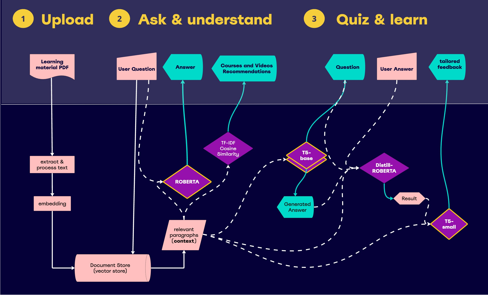

 

<h5 align="center">
  <a href="#data-science">Data Science</a>  |
  <a href="#deep-learning">Deep Learning</a> 
</h5>

# Data Science
The recommendation feature utilizes public datasets from Coursera and Udemy, along with the YouTube API. To enhance accuracy, we focused exclusively on technology-related courses within these datasets. We then preprocessed and cleaned the data using tools such as Pandas, NumPy, Scikit-learn, NLTK, and regular expressions.

The cleaning process involved several key steps: standardizing column names and contents, reordering them, dropping missing values, and removing courses with low ratings. To determine the cut-off for low ratings, we visualized the data using Matplotlib and Seaborn. Additionally, we conducted manual inspections to identify duplicate URLs, verify their functionality, and confirm the active status of the courses. After that, we merged the Coursera and Udemy datasets and integrated data from the YouTube API.

For the YouTube API integration, we utilized the 'build' function from the 'googleapiclient.discovery' module to create a YouTube service object. We then utilized the 'search' and 'videos' endpoints to search for relevant videos based on keywords and retrieve video details, respectively. This allowed us to curate a list of recommended videos based on the input text.

For the analysis, we used Term Frequency vectorization to calculate cosine similarity. The courses from Coursera and Udemy with the highest similarity scores, based on the "Summary" column, were identified as the most relevant. For YouTube videos, we opted to analyze the "Title" instead of the "Summary" description, as the descriptions were not standardized.
As a result, we chose to display the top five relevant courses/videos. The displayed information includes "Course Title", "Offered By", "Summary", "Rating", "Number of Reviews", "Level", "Hours to Complete", and "Link to the Course".

# Deep Learning
First, we implemented a question-answering agent, which answers question(s) from the user, based on an uploaded pdf document. The uploaded pdf(s) serves as a knowledge base.
For this part of the project, RoBERTa language model, an extractive language model finetuned on the SQuaD dataset, was used. The SQuaD dataset is a common dataset containing question-answer pairs, where the answers are segments of text from Wikipedia articles. The extractive language model is different than the generative one. The major difference is in its capability to return information from a context, rather than generating new text. It seems less capable than its bigger brothers, in some scenarios when textual faithfulness is needed, they are the way to go.  As a rule of thumb, the more sensitive the application, the higher the need for textual faithfulness, and the lower tolerance for paraphrases.

The Quiz Generator initiative began with the selection of the T5 model, chosen for its suitability for sequence-to-sequence tasks, including question generation. The model was fine-tuned using the SQuAD and NewsQA datasets. Between the 'small' and 'base' versions of T5, the 'base' model demonstrated better results and was subsequently prioritized for further training.

The primary challenge encountered was that, although the model generated grammatically correct questions, these questions often lacked relevance to the given context. To overcome this, a two-model approach was adopted. A first T5 model was tasked with identifying plausible answers within the text, and a second T5 model then formulated questions based on these identified answers. This methodology proved to be the most effective in producing contextually relevant and answerable questions.

**Answer Evaluation & User Feedback**
In order to provide the user with quiz feedback, we experimented with open-source LLMs such as [EleutherAI/gpt-neo](https://github.com/EleutherAI/gpt-neo), which showed promising results in performing the task in one step. However, computational resource limitations (very slow) and track requirements led us to solve this task in two steps:
[1]. Answer evaluation is a very open-ended, uncommon classification task with little to no available public datasets for training. Adding to the complexity, the input of this model stems from the output of the question-answering and -generation models, as well as user-answers, which were all not ready at the time of this feature's development. Synthetic tests were created to reflect multiple answering scenarios and used to test multiple methods, embedding models, model ensembles, similarity thresholds, and pre-trained models, and the trials decided the choice. The final algorithm proceeds in three steps: (1) direct match for obviously correct answers, (2) cosine similarity to rule out clearly irrelevant results, using ['sentence-transformers/all-MiniLM-L6-v2'](https://huggingface.co/sentence-transformers/all-MiniLM-L6-v2) which worked best on short sentences and paragraphs, (3) pre-trained [‘Giyaseddin/distilroberta-base-finetuned-short-answer-assessment’](https://huggingface.co/Giyaseddin/distilroberta-base-finetuned-short-answer-assessment) evaluates all the other nuanced scenarios such as: correct but incomplete or contradictory. Since this was a try-and-implement approach, more refinement was still needed after we deployed all models to deal with other models’ output.
[2]. Feedback generation: we trained a [‘google-t5/t5-small’](https://huggingface.co/google-t5/t5-small) model on the [BillSum](https://huggingface.co/datasets/billsum) (summarization of US Congressional and California state bills) dataset for a summarization task. This step was especially necessary since the "context" retrieved by the first model was prone to chop paragraphs, which makes them unsuitable to present to the user as answers. **[‘Oulaa/teachMy_sum’](https://huggingface.co/Oulaa/teachMy_sum)** summarizes the answer_evaluation result and the context from the PDF to help the user learn from the quiz. The output length of the summary is decided dynamically based on context length to ensure continuously cohesive output.

# Backend & Deployment 

All team members provided their functions ready for BE. The app was built with Flask with routing and session management, which were challenging for us, but they ensure seamless model interaction and phase transition, so that our users are quizzed on topics they asked about, fulfilling the desired user experience.
